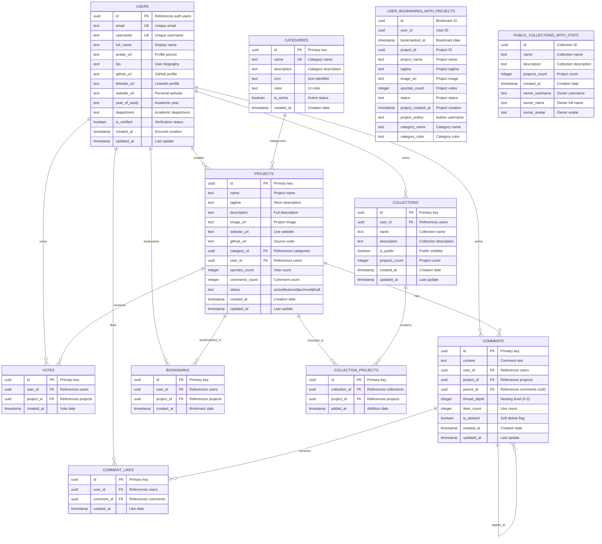

# IlliniHunt Database Entity Relationship Diagram

This document contains the Entity Relationship Diagram (ERD) for the IlliniHunt database schema.

## Mermaid ERD

## Key Relationships

### One-to-Many Relationships
- **Users → Projects**: One user can create many projects
- **Users → Votes**: One user can vote on many projects
- **Users → Comments**: One user can write many comments
- **Users → Bookmarks**: One user can bookmark many projects
- **Users → Collections**: One user can create many collections
- **Categories → Projects**: One category can contain many projects
- **Projects → Votes**: One project can receive many votes
- **Projects → Comments**: One project can have many comments
- **Projects → Bookmarks**: One project can be bookmarked by many users
- **Comments → Comment Likes**: One comment can receive many likes
- **Comments → Comments**: One comment can have many replies (self-referencing)

### Many-to-Many Relationships
- **Collections ↔ Projects**: Many-to-many through `collection_projects` table

### Unique Constraints
- **Votes**: (user_id, project_id) - One vote per user per project
- **Comment Likes**: (user_id, comment_id) - One like per user per comment
- **Bookmarks**: (user_id, project_id) - One bookmark per user per project
- **Collection Projects**: (collection_id, project_id) - One entry per project per collection

## Database Features

### Automatic Counters
- `projects.upvotes_count` - Updated by vote triggers
- `projects.comments_count` - Updated by comment triggers
- `collections.projects_count` - Updated by collection_projects triggers

### Soft Deletes
- Comments use `is_deleted` flag instead of hard deletion

### Nested Comments
- Support for up to 3 levels of comment threading via `thread_depth`

### Views
- `user_bookmarks_with_projects` - Optimized bookmark queries
- `public_collections_with_stats` - Optimized public collection queries

## Current Categories
1. Learning & Education Tools
2. Social & Communication
3. Productivity & Organization
4. Health & Wellness
5. Creative & Entertainment
6. Research & Data Analysis
7. Business & Entrepreneurship
8. Emerging Technology
